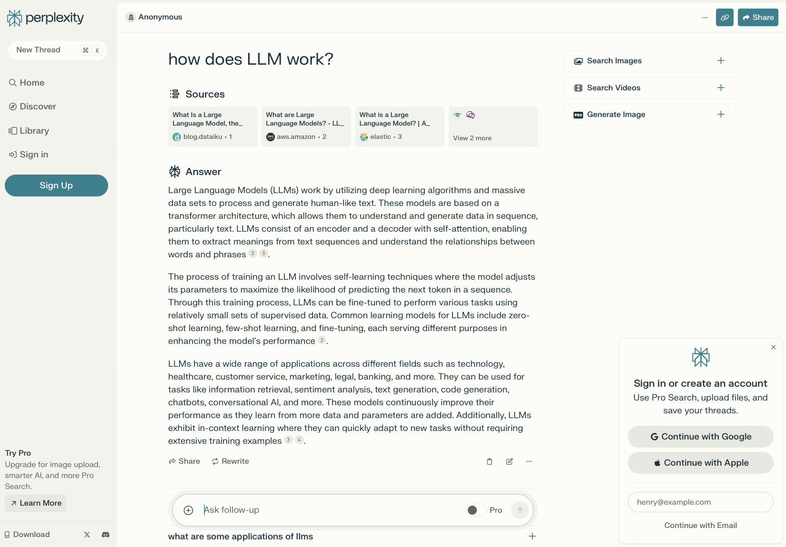

# Case Study: Perplexity.AI search engine

## Overview and Origin

* [Perplexity.AI](https://www.perplexity.ai "Answer engine where the knowledge begins") was started in August 2022 and based at San Francisco, CA. Some view Perplexity.ai as a serious contender in AI Search. It was founded by people with links to DeepMind, OpenAI & Quora etc. and is backed by some of the leading Silicon Valley investors.
* It's founders are **Aravind Srinivas, CEO, Denis Yarats, CTO, Johnny Ho, and Andy Konwinski (Databricks cofounder)**. Johnny Ho has won [2012 International Competitive Programming Contest](https://cphof.org/standings/ioi/2012).
* Company initially started as Text to SQL tool company. It's CEO Aravind Srinivas said in a [CNBC interview](https://www.cnbc.com/video/2024/03/04/google-seems-to-have-the-most-difficulty-executing-when-it-comes-to-ai-says-perplexity-ceo.html?&qsearchterm=perplexity.ai), when one of his first employee was asking about healthcare, deductibles, copay etc. he did not know what it all meant at that time. He searched Google and was served with whole list of links to read and figure out. Apparently that was the time he thought of building a search/answer engine that would provide concise, true and verifiable answers to user queries.
* Aravind Srinivas did BS and MS from IIT, Chennai, India. Aravind did internship with Open AI and Deepmind while doing his PhD at UC Berkley. He stumbled upon the book "*How Google Works*" by Eric Schmidt while working as an intern for Google's Deepmind in London. Aravind says, his take away from that book was how the research work can be translated into entrepreneurship. He found out [*Transformer*](https://en.wikipedia.org/wiki/Transformer_(deep_learning_architecture)) was highly ranked search term at that time on Google. He then did internship at Google alongside Ashish Vaswani, a key contributor to [*Transformer*](https://www.wired.com/story/eight-google-employees-invented-modern-ai-transformers-paper/). After completing his PhD from UC Berkley, he joined Open AI as a researcher, where he worked on Diffusion Model, another generative model. During that time he observed how many other companies like *Jasper*, *Copy AI* and *GitHub* were building products on top of Open AI's GPT model. They were making lot more revenue than Open AI itself. Then he thought of starting his own company but did not know what is going to be copmany's end product. (interview on [YouTube](https://www.youtube.com/watch?v=ADyaGQza8pI)) 
* They got initial seed funding of about $2.5 million. Elad Gil and Nat Friedman were initial seed investors along with few friends. Last year they raised about $25.6 million in [Series A funding](https://www.perplexity.ai/hub/blog/announcing-our-series-a-funding-round-and-mobile-app-launch). In Jan 2024 they raised another $73.6 Million in [Series B funding](https://www.perplexity.ai/hub/blog/perplexity-raises-series-b-funding-round). They have raised about $100 million in total valuing the company at around $520 million. 
* Perplexity is rumored to be finalizing their third round of fund raise valuing the company that might bring it's valuation to around $1 billion, according to [WSJ](https://www.wsj.com/tech/ai/ai-search-startup-perplexity-set-to-double-valuation-to-1-billion-b84be204) article on March 5, 2024.
* It's backers include NEA, Elad Gil, Nat Friedman (former CEO of GitHub), Databricks Inc., Susan Wojcicki (Former CEO of Youtube), Paul Buchheit (Creator of Gmail), Soleio (Designer of Messenger, Dropbox), NVIDIA, Yann LeCun (Chief Scientist, Meta), Andrej Karpathy (Founding Member, OpenAI), Ashish Vaswani (Lead contributor to Transformer), Amjad Masad (CEO, Replit), Clem Delangue (CEO, HuggingFace), Jeff Bezos (through Bezos Expeditions Fund), Tobi Lutke (Shopify founder & CEO), Bob Muglia (former Microsoft President), Bessemer Venture Partners, Naval Ravikant (founder and former CEO of AngelList), Balaji Srinivasan (former CTO of Coinbase & former GP at Andereessen Horowitz), Guillermo Rauch, Austen Allred, Factorial Funds, and Kindred Ventures,

## Business Activities

* [Perplexity.ai](https://www.perplexity.ai), founded in 2022, is an innovative alternative to Google that provides contextually rich answers and has about 10 million monthly active users according to the company. In one of the interview CEO Srinivas said their main goal right now is scale and worry about revenue generation at a later point & their funding partners aligned with that strategy for now. 
* Perplexity's mission statement 
    > "Our long-term mission is to become the best platform for answers and information, serving as the go-to source for people seeking quick, accurate answers tailored to their asks.
We envision Perplexity AI as a platform beyond a traditional search engine, evolving into a comprehensive knowledge hub where anyone can explore and learn effortlessly. In pursuit of this vision, we are committed to providing citations with every answer, providing proper attribution for sources of information and allowing for verification."
* It is built specifically to provide accurate and verifiable answers to users' search queries. 
* It prides itself as serving answers that are verifiable. By providing answers using data from verifiable sources it avoids hallucination problem, according to it's CEO. 

* As you can see in above example, rendered results point the source of information and users can go to the source itself. User is also presented with additional related questions which then can give additional information.

* The technical architecture behind Perplexity AI involves a neural network architecture similar to GPT-3, but with optimizations that enhance its functionality. It uses pplx-7b-online model which is based on [Mistral-7b](https://mistral.ai/news/announcing-mistral-7b/) model & pplx-70b-online model that is built on top of [LLaMa2-70b](https://llama.meta.com) base model. When a user inputs a query, Perplexity AI uses natural language processing (NLP) to understand the context and intent of the question. It then scours the internet in real-time, indexing web pages and content to find relevant answers. The platform ranks results to ensure the most relevant, reliable, and up-to-date information is presented.
* Perplexity AI focuses on providing accurate and detailed information in response to user queries through a chatbot-like interface, while GPT-3 excels in generating diverse types of content with human-like quality but may not offer the same level of precision in answering specific questions as Perplexity AI does.
* [Perplexity'a PPLX models](https://www.perplexity.ai/hub/blog/introducing-pplx-online-llms): pplx-7b-online and pplx-70b-online and are publicly available via [pplx-api](https://docs.perplexity.ai/docs/getting-started). PPLX models are built on top of Mistral-7b and LLaMa2-70b base models.
* pplx-7b-online and pplx-70b-online are also accessible via [Perplexity Labs](https://labs.perplexity.ai).

## Landscape 

In the last couple of years there have been lot of interest in building AI based web search tools especially after the release of ChatGPT 3.5. Below are some of the AI Search Engine companies (source [Search Engine Journal](https://www.searchenginejournal.com)).

|  Search Engine  | Company                 | Founders                    |     LLM Model                 | 
|:---------------:|:-----------------------:|:---------------------------:|:------------------:|
| Perplexity.AI   |  Perplexity Ai          | Aravind Srinivas, Denis Yarats, Johnny Ho, and Andy Konwinski |  pplx-7b-online based on Mistral-7b model & pplx-70b-online is built on top of LLaMa2-70b base model |
|  [Andi Search](#andi-search)    |    Andi                 | Angela Hoover               | Several commercial and open-source Large Language Models (LLMs), knowledge graphs, and Google, Bing, and other search engines        |
|  [Brave Search](#brave-ai-search-summarizer)   |    Brave Software       | Brendan Eich and Brian Bondy|  CodeLLM built on Mistral 8x7B model                 |
| [You AI](#you-ai-search-engine)          |   You.com               | Richard Socher              | Vicuna-13B which is trained from finetuning LLaMa 13B      |
| [Phind](#phind)           |   Hello Cognition, Inc  |                             | Phind-34B  |
| [Bing w/ Copilot](#bing-with-copilot) |   Microsoft             | Bill Gates and Paul Allen   | GPT-4     |
| [Gemini](#googles-gemini)          |   Alphabet              | Larry Page and Sergey Brin  | Gemini Ultra, Gemini Pro, and Gemini Nano  |                   

### Andi Search 
[Andi Search](https://andisearch.com) is a generative AI search engine that offers an interpretation of a better way to explore the Internet and obtain knowledge.
Andi is an AI search chatbot that's accurate, ad-free and privacy-focused. It uses a new type of search engine powered by generative AI combined with live data and semantic search technology. Instead of just links, Andi gives you answers. Andi explains and summarizes key information combined from the best sources. 
Behind the scenes, it's a new type of search engine that uses generative AI and large language models (LLMs) combined with live data, smart algorithms and semantic search technology. Andi uses large language models to understand what user is looking for, and to predict the best places to find it. Then it queries them directly in real-time, rather than using a static keyword index. 
It uses AI throughout the entire search results, not just at the top of the page the way Bing and Google SGE do.
Andi Search uses a mix of technologies.
In a 2022 Q&A, Andi Search engineers said they use several commercial and open-source Large Language Models (LLMs), knowledge graphs, and Google, Bing, and other search engines (50% of the time in 2022).

### Brave AI Search Summarizer
[Brave Search](https://search.brave.com) is a privacy-first search engine. 

The technology powering Brave consists of three LLMs trained for:
- Question answering and improving search results.
- Classification to weed out undesirable search results.
- Summarizer and paraphrasing model add the final touches.

Brave Search has built [Code LLM model](https://brave.com/blog/codellm/) built on top of Mixtral 8x7B.

### YOU AI Search Engine
[YOU](https://you.com) is an AI search engine that combines a large language model citations to websites.
You.com is an AI-powered search engine founded by Richard Socher, a prominent natural language processing (NLP) researcher and former chief scientist of Salesforce.
The AI search engine answers questions in natural language while also citing links to websites and videos that offer comprehensive coverage of the topic.
The site operates in two modes: a personal mode and a private mode.
In personal mode, users can configure their source preferences.  While in private mode, they enjoy a completely untraceable experience; no telemetry data is recorded.
YouChat can write code, summarize complex topics, generate images, write code, and create content in any language.
You.com features YouAgent, an AI agent that writes code and can run it in its own environment, then take further action based on the output.
YouChat is designed to engage in detailed discussions and conversations with users. It can understand context, ask clarifying questions, and provide follow-up information based on the user's input.

### Phind
[Phind](https://www.phind.com/search?home=true) calls itself a generative AI search engine for developers.
It does a great job of surfacing answers from trustworthy websites. Phind is an intelligent answer engine for developers to help them solve tough problems. On August 28, 2023, it announced a new LLM called Phind-CodeLlama-34B-v2 that outperforms GPT-4 on a benchmark called HumanEval.

### Bing with Copilot
[Bing with Copilot](https://www.bing.com) with Bing builds on the existing Bing experience to provide you with a new type of search.  
Beyond generating a list of relevant links, Copilot consolidates reliable sources across the web to give you a single, summarized answer. 
Copilot searches for relevant content across the web and then summarizes what it finds to generate a helpful response. It also cites its sources, so you’re able to see links to the web content it references.
Copilot relies on leading generative AI models from OpenAI, namely ChatGPT-4 and DALL-E 3. In addition to using these two OpenAI models, Copilot also relies on the large web-scraping database from the Bing search engine, Microsoft Natural Language Processing, Text to Speech (TTS) for generating lifelike speech responses, Retrieval Augmentation Generation (RAG) to ground and add context, and Azure cloud services.

### Google's Gemini
Google LLM [Gemini](https://gemini.google.com/app) works in a couple of key ways:
- Multimodal Understanding: Gemini model is trained on a massive dataset that includes text, code, audio, images, and video all together. This lets it understand the connections between these different information types.
- Unified Training Approach: Traditionally, multimodal AI involved training separate models for each data type and then somehow stitching them together. Gemini ditches this approach. It uses a single, unified training process that lets it learn how these different data types relate to each other from the start.
Gemini is a neural network architecture specifically designed for processing and understanding text. However, Gemini's additional training on other data types makes it much more versatile than a standard LLM.

Google has the disclaimer "Gemini will not always get it right. Gemini may give inaccurate or offensive responses. When in doubt, use the Google button to double-check Gemini's responses."

## Results

* Business impact: With Perplexity’s search tools, users get instant, reliable answers to any question with complete sources and citations included. There is no need to click on different links, compare answers, or endlessly dig for information. 
* In an era where misinformation and AI hallucinations are causing increasing concern, it is built on the idea that accuracy and transparency are prerequisites to making AI-powered search ubiquitous. The times of sifting through SEO spam, sponsored links, and multiple web pages will be replaced by a much more efficient way to consume and share information, propelling our society into a new era of accelerated learning and research.
* Perplexity.AI has been highly reviewed and has some big name backers which is causing huge media buzz around it. Company claims it has around 10 million users currently. 
* Something that should be mentioned is that Perplexity.ai is publisher-friendly as it links the websites from which the answers were sourced.
* The company has seen an uptick in subscribers of its premium Copilot service, which charges $20 a month for a more powerful version of the search engine. Copilot tailors search queries with custom follow-up questions, introducing the concept of generative user interfaces. It removes the burden of prompt engineering and does not require users to ask perfectly phrased questions to get the answers they seek. This enables users to gain more relevant and comprehensive answers than other AI chatbots, traditional search engines, or research tools.
* Company also offers their LLM Model subscription business. They currently have about 10k developers signed up, according to it's CEO, but no large enterprises yet. Their current estimated annual revenue is estimated to be around $10 million. 
* Of course, even if Perplexity does hit a $1 billion valuation, it has a long way to go to truly challenge Google, which has enormous resources and AI talent at its disposal—and whose parent Alphabet is valued at around $1.7 trillion.
* When a Fortune magazine reporter asked Perplexity's CEO "*how on earth Perplexity finds scale in search?*" Answer he got was “*You can ask all these questions and I think they’re all fair, pretty rational ways of thinking about it. But startups are for irrational people, right?*” Fair point!

> #### *References:* 
*[Perplexity.AI](www.perplexity.ai)*

*[CNBC](www.cnbc.com)*

*[Search Engine Journal](www.cearchEngineJournal.com)*

*[YouTube](www.youtube.com)*

*[Fortune](www.cortune.com)*

*[Wall Street Journal](www.WSJ.com)*

*[PC Magazine](www.pcmag.com)*

*[Search Engine Land](https://searchengineland.com)*
